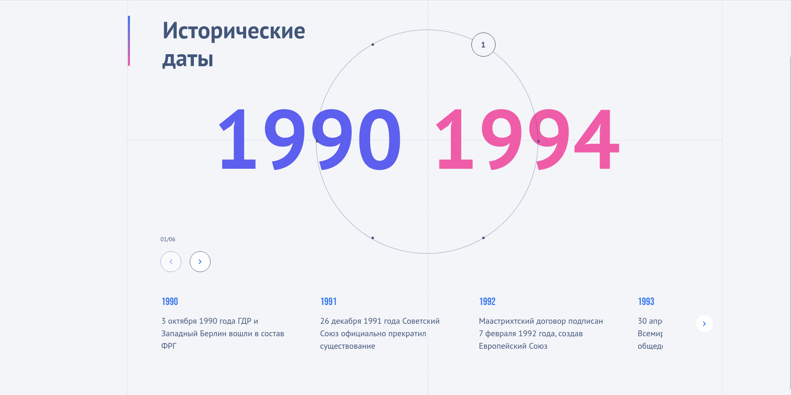

# Temporal Slider - Интерактивный компонент временной шкалы



## Описание

Интерактивный компонент для отображения исторических событий на временной шкале с возможностью навигации по различным периодам. Реализован в соответствии с макетом в Figma.

## Ключевые особенности

- Круговая временная шкала с равномерно распределенными отрезками
- Адаптивный дизайн для desktop и mobile
- Анимированные переходы между периодами
- Интерактивный слайдер событий для каждого периода
- Поддержка нескольких независимых экземпляров на странице

## Технологический стек

- **React** (v19) - ядро приложения
- **TypeScript** - статическая типизация
- **SCSS** - стилизация с препроцессором
- **Swiper** (v11) - реализация слайдера событий
- **GSAP** (v3) - плавные анимации
- **Webpack** (v5) - сборка проекта

## Установка и запуск

1. Клонируйте репозиторий:
```bash
git clone https://github.com/vldpvnnk/temporal-slider.git
cd temporal-slider
```
2. Установите зависимости:
```bash
npm install
```
3. Запустите dev-сервер:
```bash
npm start
```
Приложение будет доступно по адресу: http://localhost:3000 

4.Для production-сборки:
```bash
npm run build
```
## Структура проекта

```text
src/
├── components/          # Компоненты приложения
│   ├── EventSlider/     # Слайдер событий
│   └── TimeSlider/      # Временная шкала
├── styles/              # SCSS стили
├── types/               # Типы TypeScript
├── context.tsx          # Данные временных отрезков
├── App.tsx              # Корневой компонент
└── index.tsx            # Точка входа
``` 